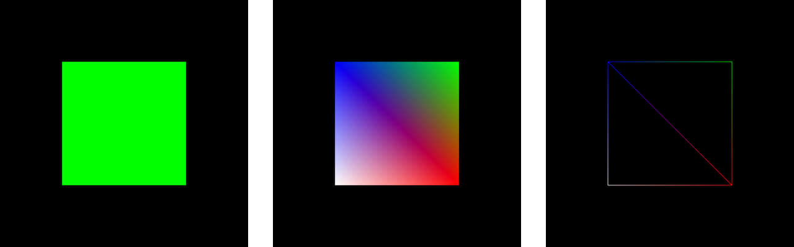

# Manejo de Indices

  

### Branches 🌳

- `sin indices`
- `con indices`
- `gradiente`
- `wireframe`

### Referencias 📚

- [Index Buffers in OpenGL](https://www.youtube.com/watch?v=MXNMC1YAxVQ)
- [WebGL 2 Fundamentals - Indexed Vertices](https://webgl2fundamentals.org/webgl/lessons/webgl-indexed-vertices.html)
- [WebGL Programming Guide](https://www.oreilly.com/library/view/webgl-programming-guide/9780133364903/) `Capitulo 7 - Hello Cube`

### Uso 💻

Para correr el código, seguir las instrucciones de la sección **Usando los ejemplos** del repo [Recursos](https://github.com/computacion-grafica-uns/Recursos).
